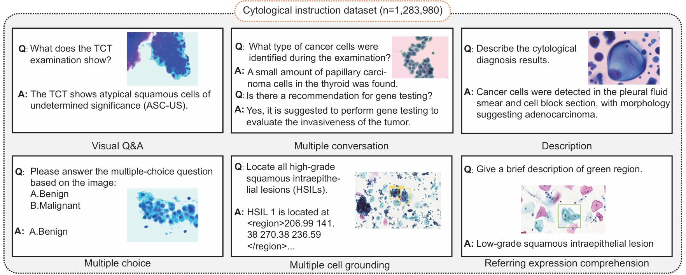

# A Multimodal AI Copilot for Interactive and Scalable Cytology
Official PyTorch implementation of the paper "A Multimodal AI Copilot for Interactive and Scalable Cytology". 🎈

## Overview



Foundation models are shifting the paradigm from task-specific pipelines toward interactive diagnostic copilots. Cytology, one of the highest-volume and most labor-intensive domains in pathology, has yet to fully benefit from these advances. Here we present CytoChat, the first multimodal generative AI copilot purpose-built for cytopathology. CytoChat was trained on more than 1.2 million instruction-answer pairs curated from over 650,000 public and private image-caption pairs, encompassing diverse task formats such as visual question answering, multi-turn dialogue, descriptive reporting, multiple-choice reasoning, multi-cell grounding, and referring expression comprehension. To enable rigorous evaluation, we curated and publicly released a high-quality cytology benchmark that integrates data from both private and public sources, spans the full spectrum of instruction formats, and enables direct comparison with five state-of-the-art large language model baselines. At the patch level, CytoChat outperformed all baselines across tasks, achieving an average multiple-choice accuracy of 71.0% and exceeding others by 18.5% to 41.1%. Patch-level predictions were further aggregated into robust slide-level assessments. By bridging visual understanding with multimodal reasoning and interactive guidance, CytoChat lays the foundation for next-generation cytopathology, enabling more accurate, reproducible, and collaborative diagnostics at scale. 

## Quickstart

### 1. Setup Environment
First, create and activate a Conda virtual environment, then install the required dependencies.

```bash
# Create and activate the environment
conda env create -n cytochat -f environment.yml
conda activate cytochat
```

### 2\. Prepare Demo Data

To prepare the demo data, follow these steps:

**Download the Data**:  
First, download the relevant images and label files from the following link:
[Benchmark Data](https://osf.io/gkh5j/overview?view_only=97e710f368bb4b2abbb8afa80c0d8ad3).  
Extract the files to a local directory, such as `/path/to/your/data/`.

**Format the Data**:  
Refer to the data preparation format from the third-party repository's guide:  
[Preparation Guide](https://llamafactory.readthedocs.io/en/latest/getting_started/data_preparation.html).  
Convert the downloaded images and labels into a JSONL format. Each line in the JSONL file should be a JSON object containing a `messages` array (for user-assistant interactions) and an `images` array (listing relative paths to the images).

**Data Format Example**:  
Below is an example of the expected JSONL structure. Save this as a file, e.g., `demo_data.jsonl`, where each line is a single JSON object.
```bash
{"messages": [{"content": "<image>Locate all Satellite.", "role": "user"}, {"content": "Satellite 1 is located at <region>350.29 244.33 353.71 248.9</region>. Satellite 2 is located at <region>354.77 260.54 358.19 265.11</region>.", "role": "assistant"}], "images": ["/path/to/your/data/resized_H_19747_-154080_157680.jpg"]}
{"messages": [{"content": "<image>Describe the Cytology diagnosis results.", "role": "user"}, {"content": "Cervical intraepithelial neoplasia 2 (CIN 2).", "role": "assistant"}], "images": ["/path/to/your/data/resized_H_19747_-154080_157680.jpg"]}
```

### 3\. Download checkpoints
Before proceeding with the data preparation, please download the required model weights from the following Hugging Face repository:

- **Model Weights**: [CytoChat Model on Hugging Face](https://huggingface.co/jaylin960111/CytoChat/upload/main)

## Usage
```bash
cd CytoChat/libs/LLaMA-Factory

DISABLE_VERSION_CHECK=1 python scripts/vllm_infer.py --model_name_or_path $MODEL_PATH --dataset $DATASET_NAME --template qwen2_vl --save_name $OUTPUT_FILE
```

### `--model_name_or_path`
- **Purpose**: Specifies the path or name of the model to load
- **Format**: String
- **Example Values**: 
  - `$MODEL_PATH` (environment variable pointing to model directory)
  - `/path/to/your/model`
  - `Qwen/Qwen2-VL-7B-Instruct` (Hugging Face model name)
- **Description**: 
  - Can be a local path to a model directory
  - Can also be a model name from Hugging Face Hub
  - The model must be compatible with Qwen2-VL architecture

### `--dataset`
- **Purpose**: Specifies the name of the dataset for inference
- **Format**: String
- **Example Values**: 
  - `$DATASET_NAME` (environment variable pointing to dataset name)
  - `cytology_test`
  - `medical_qa`
- **Description**:
  - The dataset must be pre-defined in `dataset_info.json`
  - The dataset should contain images and corresponding text instructions
  - Supports custom datasets

### `--template`
- **Purpose**: Specifies the conversation template for the model
- **Format**: String
- **Example Value**: `qwen2_vl`
- **Description**:
  - `qwen2_vl` is a conversation template specifically designed for Qwen2-VL series models
  - The template formats input conversations and adds appropriate special tokens
  - Ensures correct model input format, especially for image token processing

### `--save_name`
- **Purpose**: Specifies the filename for saving inference results
- **Format**: String
- **Example Values**: 
  - `$OUTPUT_FILE` (environment variable)
  - `inference_results.json`
  - `cytology_predictions.jsonl`
- **Description**:
  - Inference results will be saved to this file
  - Typically saved in JSON or JSONL format
  - Contains model prediction outputs

## License

### Usage Terms
- **Research Use**: Permitted for academic and non-commercial research purposes
- **Commercial Use**: Requires explicit permission from the authors
- **Attribution**: Must cite the original paper when using this work *(Publication details are pending)*
- **Redistribution**: Limited to non-commercial educational purposes